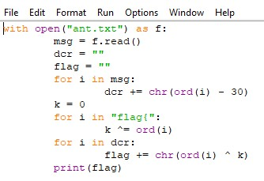

# Cryptography-1

## Описание

Не задавай лишних вопросов и просто сделай это. Ах точно, это должно тебе помочь **/94.\*A=d"FR#,%AFO9U.(**

Ответ в формате `flag{полученный_текст}`

[Cryptography-1.txt](../../_resources/Cryptography-1.txt)

## Решение

Напишем программу которая раздекриптит эту строку **/94.\*A=d"FR#,%AFO9U.(**

## Ответ

`flag{Th1s\_CrypT\_Fl@g}`