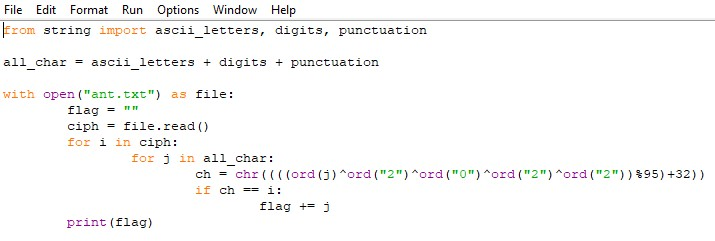

# Cryptography-2

## Описание

В этот раз будет также как и в прошлом задании) А вот и строка, которая тебе пригодится **%/$&:7jS2}g$2{}a1V37R}dSb&@**

Ответ в формате `flag{полученный_текст}`

[Cryptography-2.txt](../../_resources/Cryptography-2.txt)

## Решение

Напишем программу которая раздекриптит эту строку **%/$&:7jS2}g$2{}a1V37R}dSb&@**

## Ответ

`flag{tH1s\_EasY\_Cr4pt0_F1@g}\`