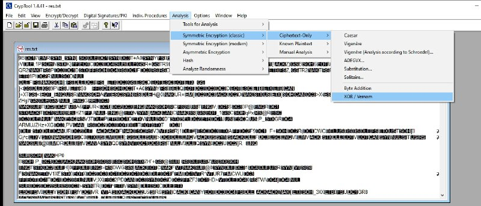
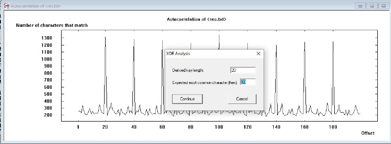
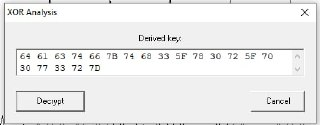
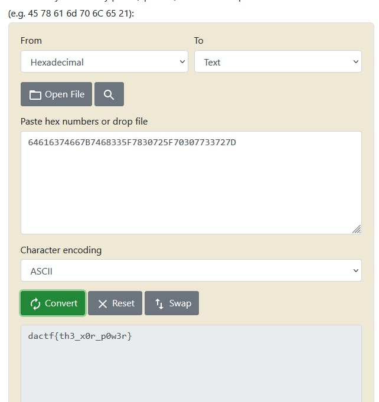

# XanOalyRsis

## Описание

Решил я как-то позаниматься криптографией. Нашёл файл и стал решать. Могу похвастаться временем прохождения ( 20 временных единиц ).

[res.txt](../../_resources/res.txt)

## Решение

Для начала скачаем инструмент CrypTool для работы с текстовым документом. Открываем текстовый документ \`res.txt\`. Заходим во вкладку \`Analysis\` -> \`Symmetric Encryption (classic)\` -> \`Ciphertext-Only\` -> \`XOR/Vemam\`.

В открывшемся окне вводим \`length = 20\` и \`hex = 20\`.

Видим hex строку.

Декодируем и получаем ответ.

## Ответ

`dactf{th3_x0r_p0w3r}`