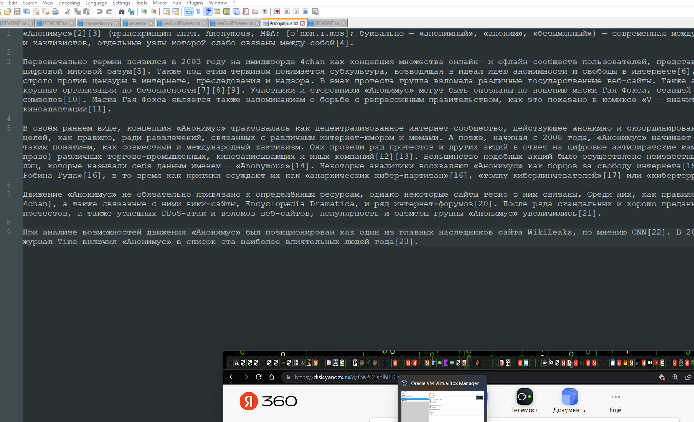
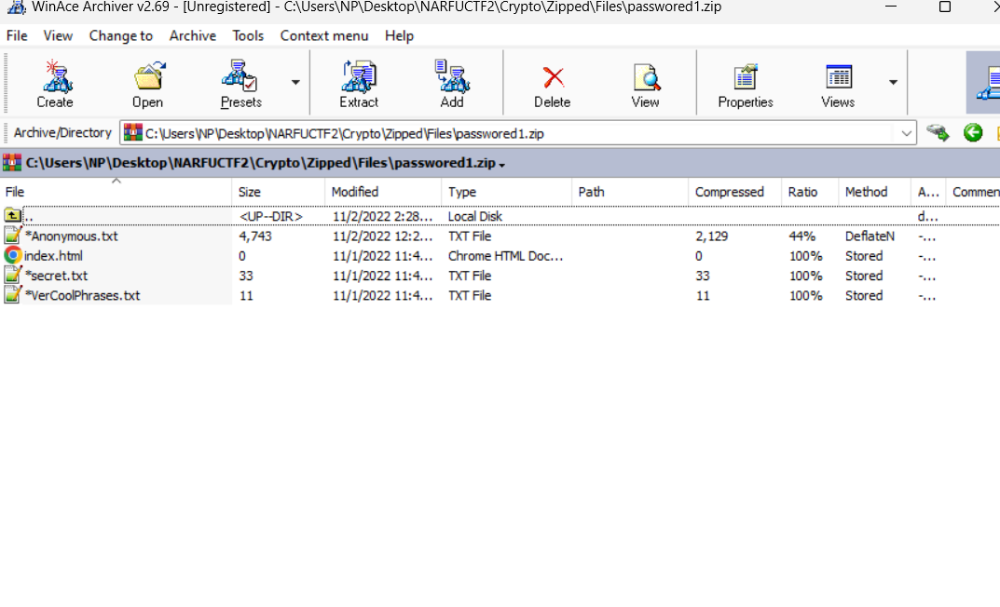
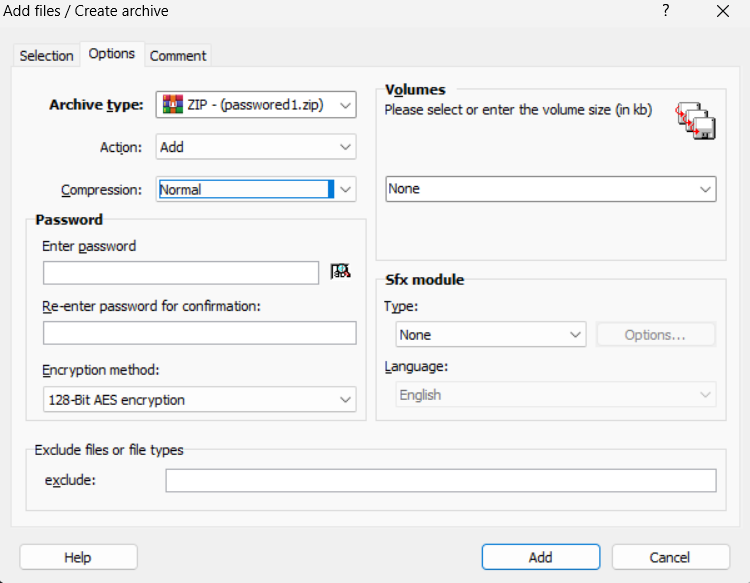
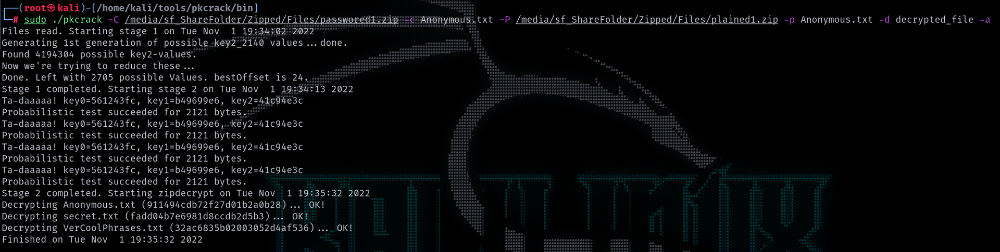

# Zipped

## Описание

Привет! Я тут занялся статьями, сейчас вот пишу про группировку одну. Вот вам тизер. Но статейка не для всех, только для моих корешей. Так, что я конкретно постарался, чтобы поставить сложный пароль на архивчик.

## Решение

Первым делом нужно понять, что нам дано. Нам дан скрин, на котором сразу в глаза бросается ссылка, бежим скачивать файл. 

[passwored1.zip](../../_resources/passwored1.zip)

Глядим в архив и наблюдаем файлы:

Однако архив имеет пароль. Пароль не словарный, так что брутить его не имеет смысла, это понятно из описания. 

Гуглим атаки на ZIP. Если покопаться, то можно найти PlainText Attack на ZIP. Находим инструмент, который позволяет провести атаку подбора пароля, если известен хотя бы один файл в открытом виде, который также есть в зашифрованном архиве. 

Ссылка на инструмент - https://github.com/keyunluo/pkcrack

Нам нужно понять откуда взять открытый текст. На самом деле файл Anonymous.txt это скопированая часть из википедии.

Далее, самое сложное: настройки архивации должны быть такими же. 

Дальше просто создаем файл, шифруем его используя слудющие настройки.

Ну, а дальше просто запускаем взлом архива. 

## Ответ
`narfuctf{unbreee34aaakable_zippp}`
