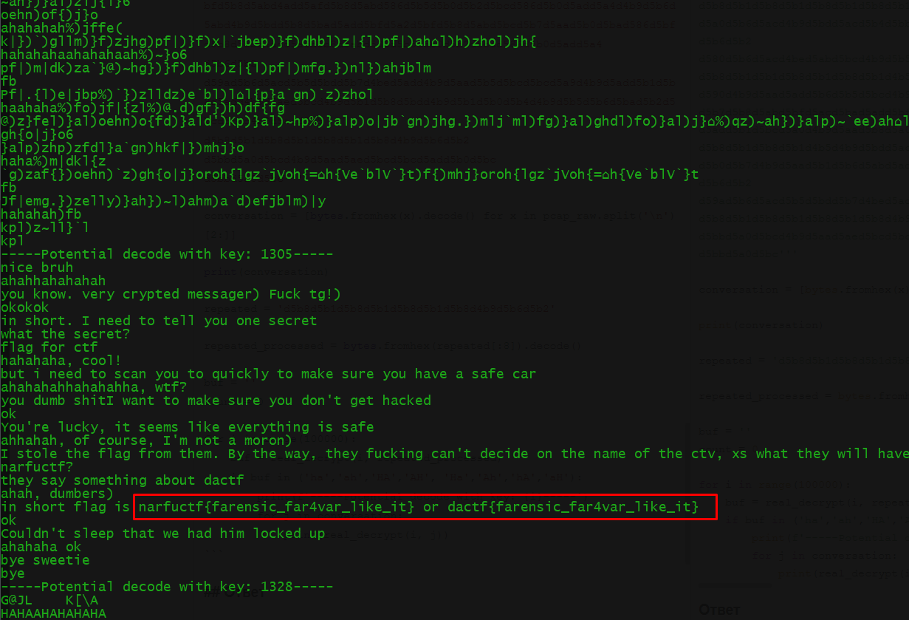

# Secure

## Описание

У нас есть запись сетевого траффика, в котором  точно есть флаг. Сможешь его добыть?
 

[caped.pcap](../../_resources/caped.pcap)


## Решение

Первым делом идем в статистику и смотрим самые продолжительные сессии. Включаем первую и смотрим поток. 


Видим, что у нас есть упоминание какого-то безопасного чата, а также упоминание веб сервера.

Видно, что идет скачивание какого-то файла, который на самом деле является архивом.


Изучаем файлы и понимаем, что ключ в траффике не передавался, так как оба клиента, знают ключ.

Изучаем код клиента, и видим функцию, которая шифрует сообщения. 
```python3
def encrypt(cipher, text):
    key = 0
    
    for i in cipher:
        key = key + ord(i)
    
    ciphertext = ''

    for i in text:
        ciphertext += chr(ord(i)^key)
   
    return ciphertext
```

Логика шифрования заключается в том, чтобы просуммировать ord всех символов в ключе и проксорить получившееся значение со всеми символами в тексте. То есть при таком шифровании у нас определенный символ будет кодироваться другим определенным символом. Это нам дает то, что зная исходный текст, мы можем попробовать подобрать ключ грубой силой. 

Очевидно исходного текста мы не знаем...или...Если посмотреть первый диалог, то заметим, что часто появляется слова типа "ahahahhah" от John. Соответственно, можно предположить, что смех встречается и в зашифрованном канале.

Зная это, можем написать скрипт, который будет искать перебирать ключ:

```python
def real_decrypt(key, text):
    decode = ''
    
    for i in text:
        decode += chr(ord(i)^key)
    
    return decode

pcap_raw =  '''616c6578
4a6f686e
d5b7d5b0d5bad5bcd4b9d5bbd5abd5acd5b1
d5b8d5b1d5b8d5b1d5b1d5b8d5b1d5b8d5b1d5b8d5b1d5b8d5b1
d5a0d5b6d5acd4b9d5b2d5b7d5b6d5aed4b7d4b9d5afd5bcd5abd5a0d4b9d5bad5abd5a0d5a9d5add5bcd5bdd4b9d5b4d5bcd5aad5aad5b8d5bed5bcd5abd4b0d4b9d59fd5acd5bad5b2d4b9d5add5bed4b8d4b0
d5b6d5b2d5b6d5b2d5b6d5b2
d5b0d5b7d4b9d5aad5b1d5b6d5abd5add4b7d4b9d590d4b9d5b7d5bcd5bcd5bdd4b9d5add5b6d4b9d5add5bcd5b5d5b5d4b9d5a0d5b6d5acd4b9d5b6d5b7d5bcd4b9d5aad5bcd5bad5abd5bcd5ad
d5aed5b1d5b8d5add4b9d5add5b1d5bcd4b9d5aad5bcd5bad5abd5bcd5add4a6
d5bfd5b5d5b8d5bed4b9d5bfd5b6d5abd4b9d5bad5add5bf
d5b1d5b8d5b1d5b8d5b1d5b8d5b1d5b8d4b5d4b9d5bad5b6d5b6d5b5d4b8
d5bbd5acd5add4b9d5b0d4b9d5b7d5bcd5bcd5bdd4b9d5add5b6d4b9d5aad5bad5b8d5b7d4b9d5a0d5b6d5acd4b9d5add5b6d4b9d5a8d5acd5b0d5bad5b2d5b5d5a0d4b9d5add5b6d4b9d5b4d5b8d5b2d5bcd4b9d5aad5acd5abd5bcd4b9d5a0d5b6d5acd4b9d5b1d5b8d5afd5bcd4b9d5b8d4b9d5aad5b8d5bfd5bcd4b9d5bad5b8d5ab
d5b8d5b1d5b8d5b1d5b8d5b1d5b8d5b1d5b1d5b8d5b1d5b8d5b1d5b8d5b1d5b1d5b8d4b5d4b9d5aed5add5bfd4a6
d5a0d5b6d5acd4b9d5bdd5acd5b4d5bbd4b9d5aad5b1d5b0d5add590d4b9d5aed5b8d5b7d5add4b9d5add5b6d4b9d5b4d5b8d5b2d5bcd4b9d5aad5acd5abd5bcd4b9d5a0d5b6d5acd4b9d5bdd5b6d5b7d4bed5add4b9d5bed5bcd5add4b9d5b1d5b8d5bad5b2d5bcd5bd
d5b6d5b2
d580d5b6d5acd4bed5abd5bcd4b9d5b5d5acd5bad5b2d5a0d4b5d4b9d5b0d5add4b9d5aad5bcd5bcd5b4d5aad4b9d5b5d5b0d5b2d5bcd4b9d5bcd5afd5bcd5abd5a0d5add5b1d5b0d5b7d5bed4b9d5b0d5aad4b9d5aad5b8d5bfd5bc
d5b8d5b1d5b1d5b8d5b1d5b8d5b1d4b5d4b9d5b6d5bfd4b9d5bad5b6d5acd5abd5aad5bcd4b5d4b9d590d4bed5b4d4b9d5b7d5b6d5add4b9d5b8d4b9d5b4d5b6d5abd5b6d5b7d4b0
d590d4b9d5aad5add5b6d5b5d5bcd4b9d5add5b1d5bcd4b9d5bfd5b5d5b8d5bed4b9d5bfd5abd5b6d5b4d4b9d5add5b1d5bcd5b4d4b7d4b9d59bd5a0d4b9d5add5b1d5bcd4b9d5aed5b8d5a0d4b5d4b9d5add5b1d5bcd5a0d4b9d5bfd5acd5bad5b2d5b0d5b7d5bed4b9d5bad5b8d5b7d4bed5add4b9d5bdd5bcd5bad5b0d5bdd5bcd4b9d5b6d5b7d4b9d5add5b1d5bcd4b9d5b7d5b8d5b4d5bcd4b9d5b6d5bfd4b9d5add5b1d5bcd4b9d5bad5add5afd4b5d4b9d5a1d5aad4b9d5aed5b1d5b8d5add4b9d5add5b1d5bcd5a0d4b9d5aed5b0d5b5d5b5d4b9d5b1d5b8d5afd5bc
d5b7d5b8d5abd5bfd5acd5bad5add5bfd4a6
d5add5b1d5bcd5a0d4b9d5aad5b8d5a0d4b9d5aad5b6d5b4d5bcd5add5b1d5b0d5b7d5bed4b9d5b8d5bbd5b6d5acd5add4b9d5bdd5b8d5bad5add5bf
d5b8d5b1d5b8d5b1d4b5d4b9d5bdd5acd5b4d5bbd5bcd5abd5aad4b0
d5b0d5b7d4b9d5aad5b1d5b6d5abd5add4b9d5bfd5b5d5b8d5bed4b9d5b0d5aad4b9d5b7d5b8d5abd5bfd5acd5bad5add5bfd5a2d5bfd5b8d5abd5bcd5b7d5aad5b0d5bad586d5bfd5b8d5abd4add5afd5b8d5abd586d5b5d5b0d5b2d5bcd586d5b0d5add5a4d4b9d5b6d5abd4b9d5bdd5b8d5bad5add5bfd5a2d5bfd5b8d5abd5bcd5b7d5aad5b0d5bad586d5bfd5b8d5abd4add5afd5b8d5abd586d5b5d5b0d5b2d5bcd586d5b0d5add5a4
d5b6d5b2
d59ad5b6d5acd5b5d5bdd5b7d4bed5add4b9d5aad5b5d5bcd5bcd5a9d4b9d5add5b1d5b8d5add4b9d5aed5bcd4b9d5b1d5b8d5bdd4b9d5b1d5b0d5b4d4b9d5b5d5b6d5bad5b2d5bcd5bdd4b9d5acd5a9
d5b8d5b1d5b8d5b1d5b8d5b1d5b8d4b9d5b6d5b2
d5bbd5a0d5bcd4b9d5aad5aed5bcd5bcd5add5b0d5bc
d5bbd5a0d5bc'''

conversation = [bytes.fromhex(x).decode() for x in pcap_raw.split('\n')[2:]]

print(conversation)

repeated = 'd5b8d5b1d5b8d5b1d5b8d5b1d5b8d4b9d5b6d5b2'

repeated_processed = bytes.fromhex(repeated[:8]).decode()

buf = ''
count = 0

for i in range(100000):
    buf = real_decrypt(i, repeated_processed)
    if buf in ('ha','ah','HA','AH', 'Ha','Ah','hA','aH'):
        print(f'-----Potential decode with key: {i}-----')
        for j in conversation:
            print(real_decrypt(i, j))
```

На выходе получим расшифрованный текст:



## Ответ

`narfuctf{farensic_far4var_like_it}`