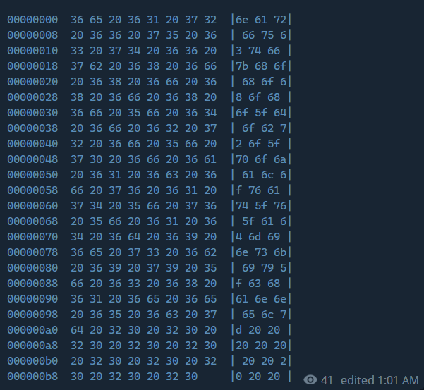

# ZolotoeDno

## Описание

Держи ссылку на канал админа - https://t.me/GoldenHackSpace. Ищи свой флаг там.

## Решение

Листаем канал в самый верх и видим, что у нас есть дамп, который содержит хекс. Сначала переводим дамп в ascii и получаем байткод, далее байткод декодируем. 

https://cyberchef.org/#recipe=To_Hex('Space',0)To_Hexdump(8,false,false,false)&input=bmFyZnVjdGZ7aG9ob2hvaG9fZG9icm9fcG9qYWxvdmF0X3ZfYWRtaW5za2l5X2NoYW5uZWx9ICAgICAgICAgIA - Ссылка на рецепт, в котором было сделано задание. 

Двойной хекс получается :)

## Ответ

`narfuctf{hohohoho_dobro_pojalovat_v_adminskiy_channel}`