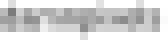

# Pixel redactor

## Описание

Привет! Ты ведь смотрел те самые фильмы, где камеру приближают до бесконечности без потери качества? Я имею ввиду то, что там постоянно повышается резкость изображения. Мы считаем, что фильмы не обманывают. Кстати, у нас как раз есть одно такое изображение. Сможешь прочитать, что там написано?

**Ответ в формате narfuctf{полученныйтекст}**
 

## Решение

Для решения данного задания требуется погуглить инструменты, который могут депикселизировать изображения. Из популярных инструментов будет 2: Depix и Unredacter, который является более прокачанной версией предыдущего. Исходя из названия задания можно предположить, что использовался второй инструмент.

Далее устанавливаем его по ссылке https://github.com/bishopfox/unredacter

Сложность задания больше заключается в том, чтобы заставить этот инструмент работать :) 

Далее, просто подсовываем ему картинку и наачинаем брутить. 

## Ответ

`narfuctf{damnpixels}`