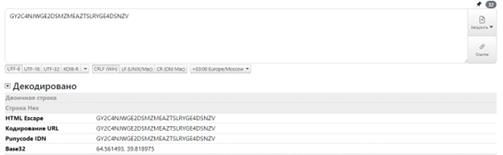
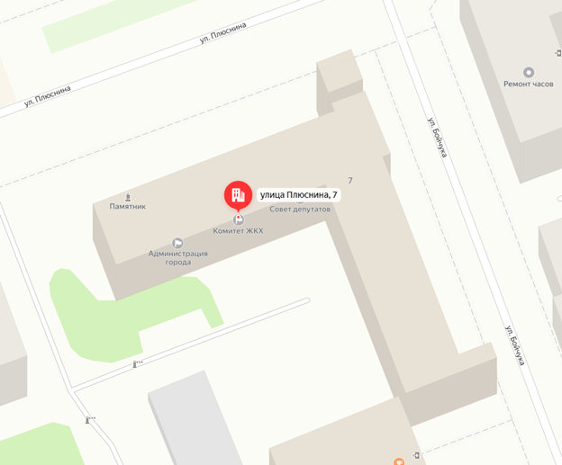
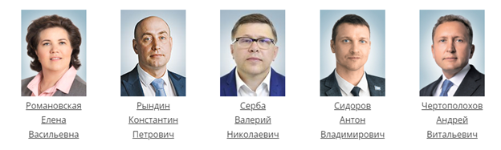
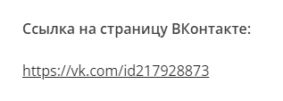
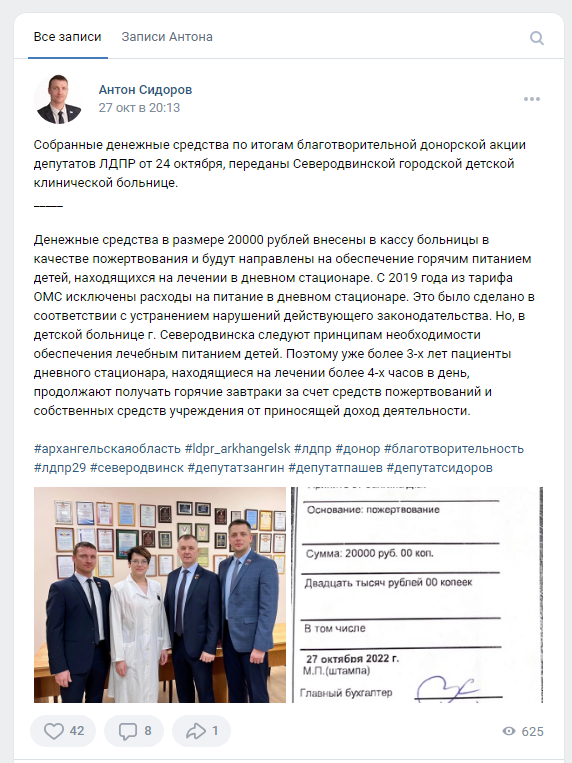

# Donation

## Описание
Недавно Антон пожертвовал некую сумму денег в благотворительный фонд. Но мне он ничего не рассказал. А так хочеться узнать сумму. Из-за частых вопросов Антон дал мне строку символов "GY2C4NJWGE2DSMZMEAZTSLRYGE4DSNZV" и сказал что это поможет мне с ответом на мой вопрос. Но я ничего не понял, помоги мне разгадать тайну человечества)

## Решение
Необходимо раздекодить исходное сообщение. 

Увидим, что это base32. Он дает нам координаты. Они приводят нас к следующему зданию:

Нажав на совет депутатов, увидим ссылку на сайт: sevgorsovet.ru
По условию задачи необходимо найти Антона:

Если рассмотреть страницу Антона, то можно найти ссылку на ВК

Первый пост в ВК показывает сумму пожертвования:

## Ответ
`DACTF{20000}`