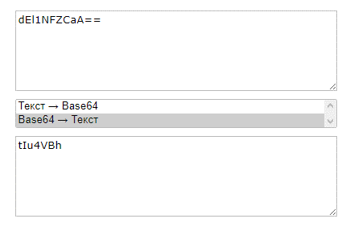
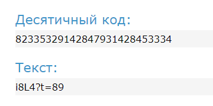
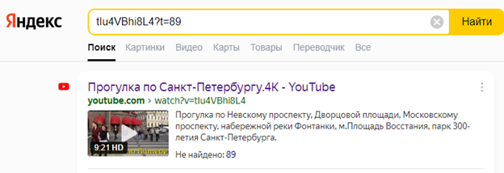
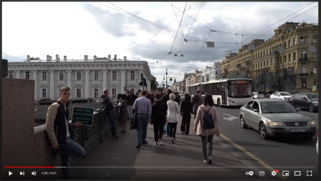

# Phone number

## Описание
Недавно познакомился с молодым человеком, но забыл записать его номер телефона. Но мне повезло! Он оставил сообщение на листочке "dEl1NFZCaA==+82335329142847931428453334". Может ты знаешь что это такое? 

## Решение
Можно понять, что до знака «плюс» расположен base64.
dEl1NFZCaA== переводится как tIu4VBh

После знака плюс стоят цифры, которые представляют собой десятичное представление букв.
82335329142847931428453334 переводится как i8L4?t=89

Знак «плюс» в данном случае показывает, что необходимо объединить два фрагмента полученных сообщений.
В итоге получаем следующее: tIu4VBhi8L4?t=89
Если поискать данный набор символов в интернете, то выдаст видео на Youtube. Конец сообщения, а точнее t=89 говорит о том, что необходимая часть видео находится на 89 секунде.

Если перейти по видео на 89 секунду, то мы увидим необходимый номер телефона:

## Ответ
`DACTF{89635559039}`
