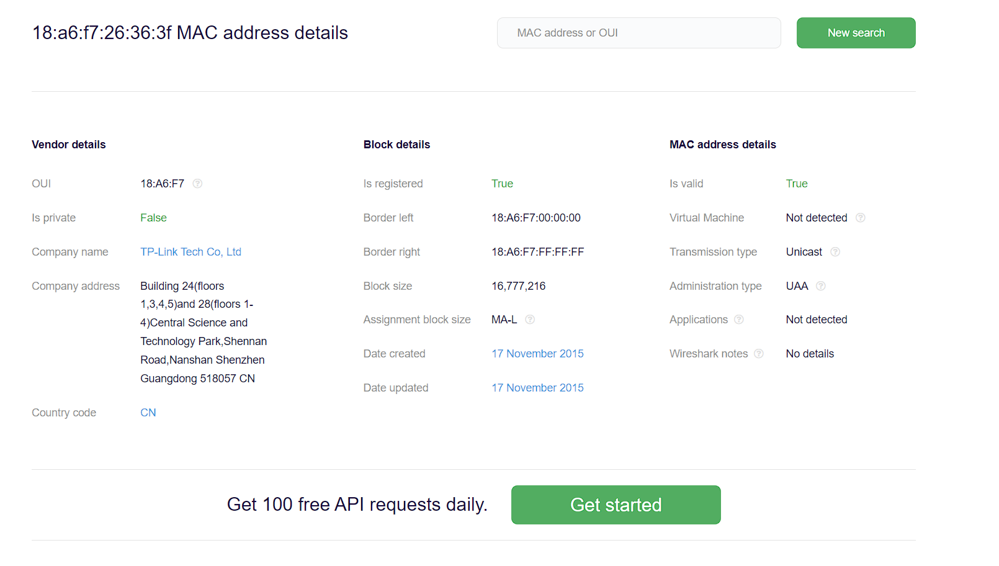
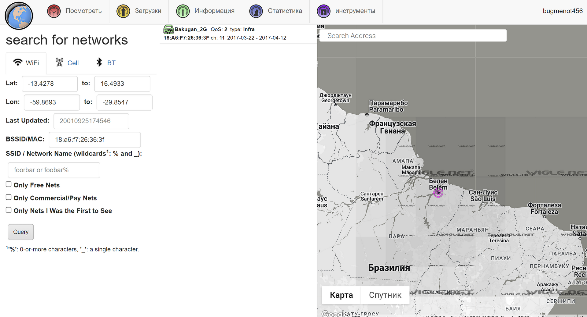

# Probivala

## Описание

Имеется MAC - `18:a6:f7:26:36:3f`. Сможешь определить, где находится устройство с заданным MAC?

**Ответ в формате narfuctf{улица_номердома_город_страна}**

## Решение

Смотрим к чему относится этот MAC:

Видно, что производитель TP-Lnik, что говорит нам о том, что это скорее всего будет точка доступа. Далее следует погуглить как искать по MAC точки доступа. 

Тогда мы наткнемся на сайт - https://wigle.net/. Это самая крупная база по точкам доступа. 

Но для того, чтобы решить задание требуется войти в аккаунт. Наверное его можно зарегать, но админ пользуется bugmenot.com, так что зашел под публичной учеткой :)

Город Белен - Бразилия

Далее ищем 

## Ответ

`narfuctf{Av._Generalíssimo_Deodoro_1533_Belém_Brasil}`