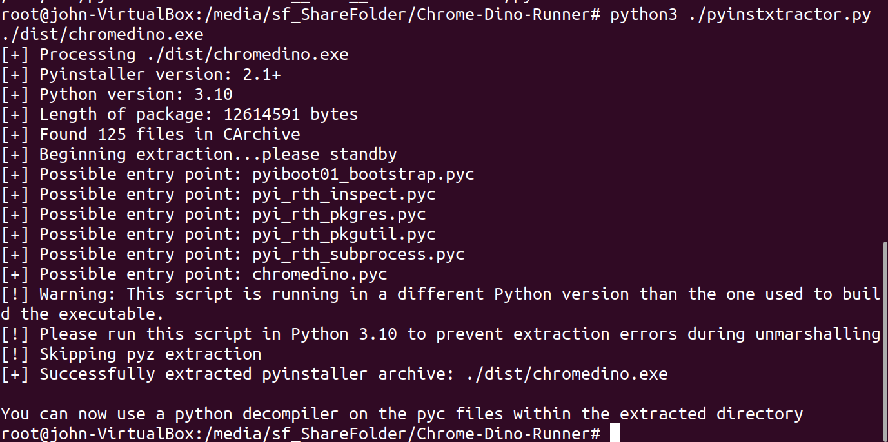
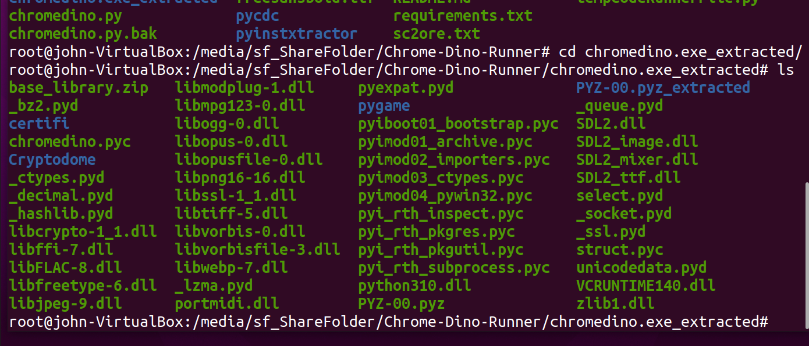
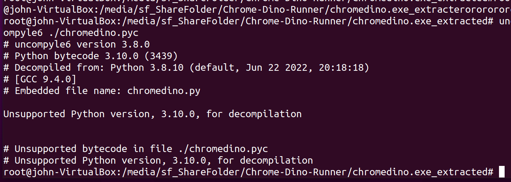
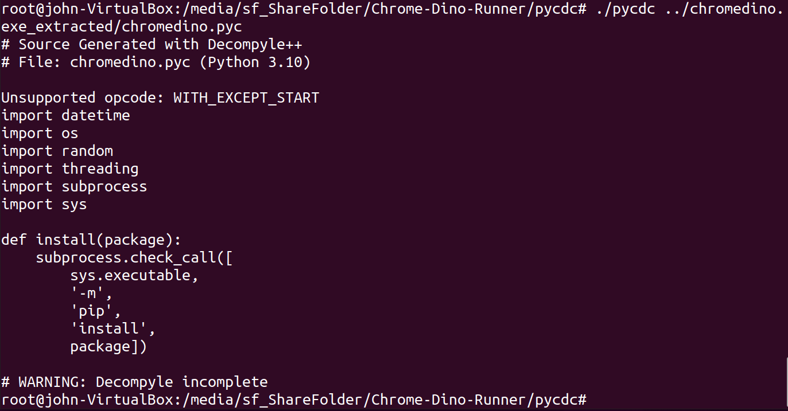
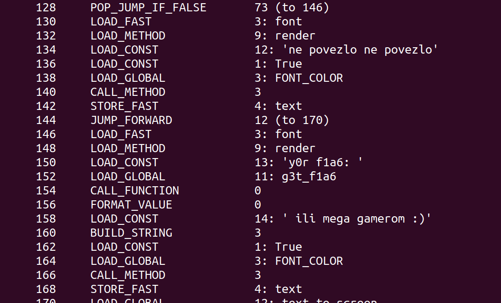
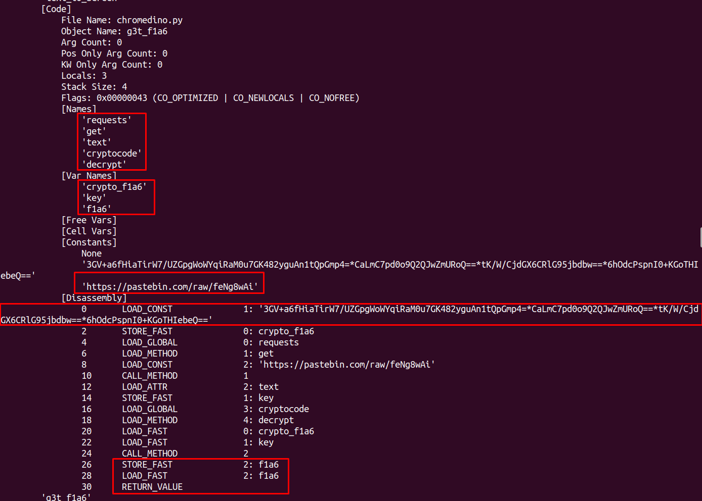
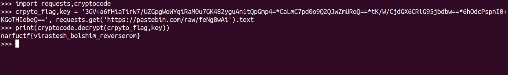

# Decomponozzover

## Описание

Ага, читеришь?

[dinozover_patched.rar](../../_resources/dinozover_patched.rar)

## Решение

Тут уже не прокатаят старые методы, потому что здесь просто нельзя выиграть. Тогда начинаем думать. 

Получаем на вход бинарь. Можно его закинуть в иду, чекнуть строки и увидеть упоминание Python. Делаем вывод, что это просто упакованый Python.

Упакованный код реверсить бессмысленно. Так что попробуем снять пакер.

Для этого используем `pyinstxtractor`

Команда: `python3 ./pyinstxtractor.py ./dist/chromedino.exe`

Окей, нас есть распакованный код. 

Отсюда нас интересует скомпилированный байткод, который называется `chromedino.pyc`

Если мы попытаемся использовать uncompyle6, то столкнемся с ошибкой. Это потому, что код скомпилирован на Python3.10, который еще не поддерживается этой программой. 

Окей, гуглим дальше, натыкаемся на менее популярный инструмент - `pycdc`. 

Попробуем использовать его для декомпиляции. Соберем его и натравим на файл.

Эта утилита уже показывает несколько строк декомпилированного кода. Но этого все равно не достаточно.

Тогда используем другой инструмент, который позвоит нам залезть в недра байткода - `pycdas`, который собирается вместе с `pycdc`.

Уже лучше, видим упоминания флага. 

Так, листаем дальше и натыкаемся на объект, который является функцией получения флага. Начинаем читать и восстанавливать логику кода. 

Видно, что у нас есть обращение к пастбину, криптованая строка, которые являются зашифрованным флагом и ключом, соответственно. Также видим, что возвращаемая переменная имеет название `f1a6`. Круть! 

Также в коде палится то, что используется функция `decrypt из cryptocode`

Супер! Есть все , что нужно! Можем декриптить флаг. 

## Ответ
`narfuctf{virastesh_bolshim_reverserom}`