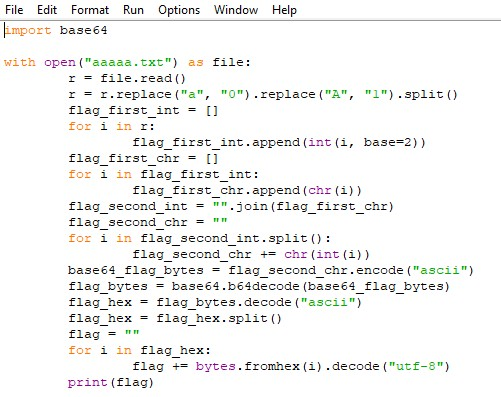

# AAAAA

## Описание

Нам отправили один странный файл, в нём одни буквы `A` и **`a`**. Мы поняли что там написано, но сможешь ли ты это сделать?

Ответ в формате `flag{полученный_текст}`

[aaaaa.txt](../../_resources/aaaaa.txt)

## Решение

Напишем программу которая выведет нам ответ.

## Ответ

`flag{E@sY_stEgkA_F1aG}`