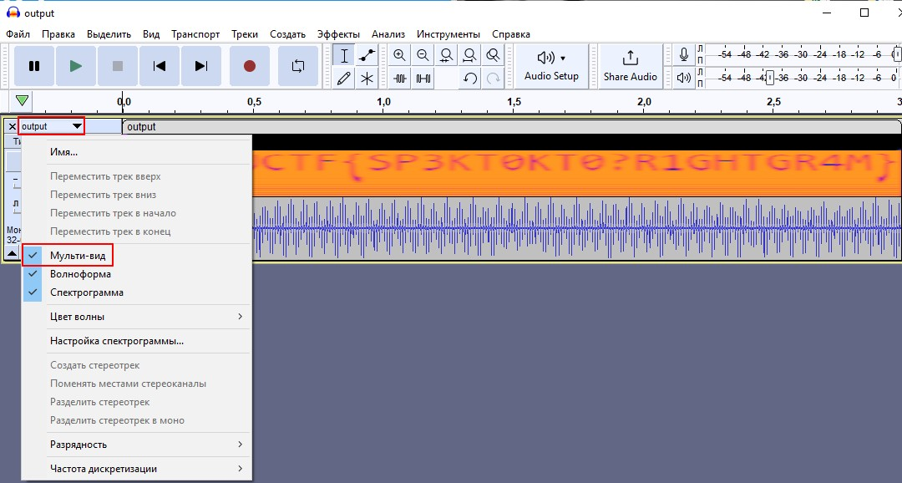

# Noises

## Описание
Мой друг решил посмеяться надо мной и оправил ауидиофайл с шумами. Я не могу понять что в нём такого. Может ты сможешь разобраться?
[Ссылка на аудиофайл](https://drive.google.com/file/d/1WcJ8nXSM1WcrwCwKs-uka0mV19XunG0b/view?usp=sharing)

## Решение
Заходим в Audacity и открываем аудиозапись. После включаем мульти-вид и видим ответ на звуковой дорожке.

## Ответ
`NARFUCTF{SP3KT0KT0?R1GHTGR4M}`
