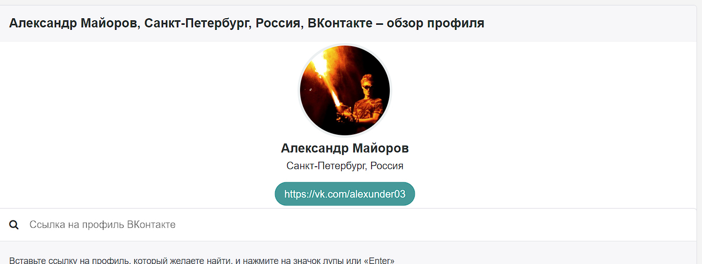
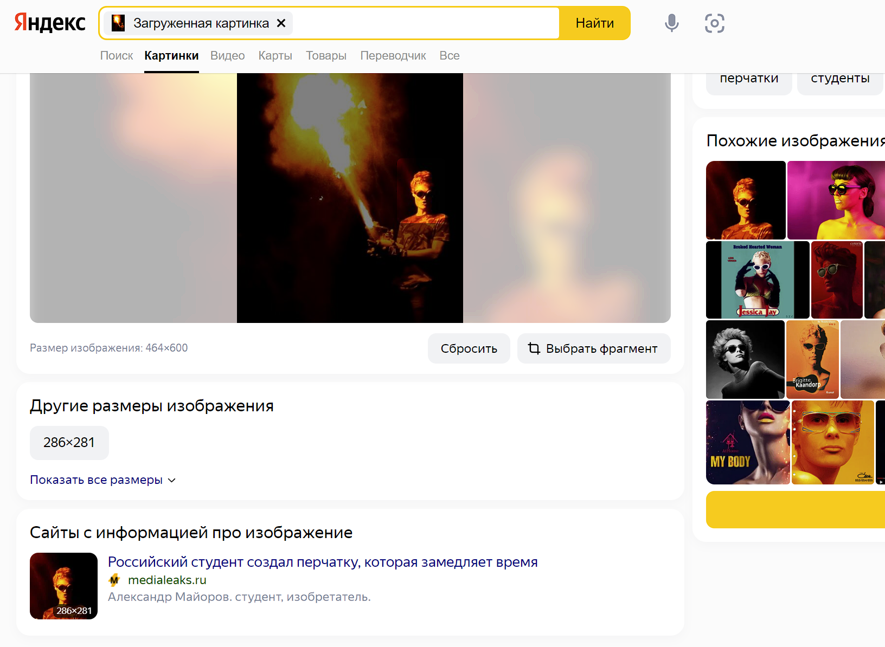
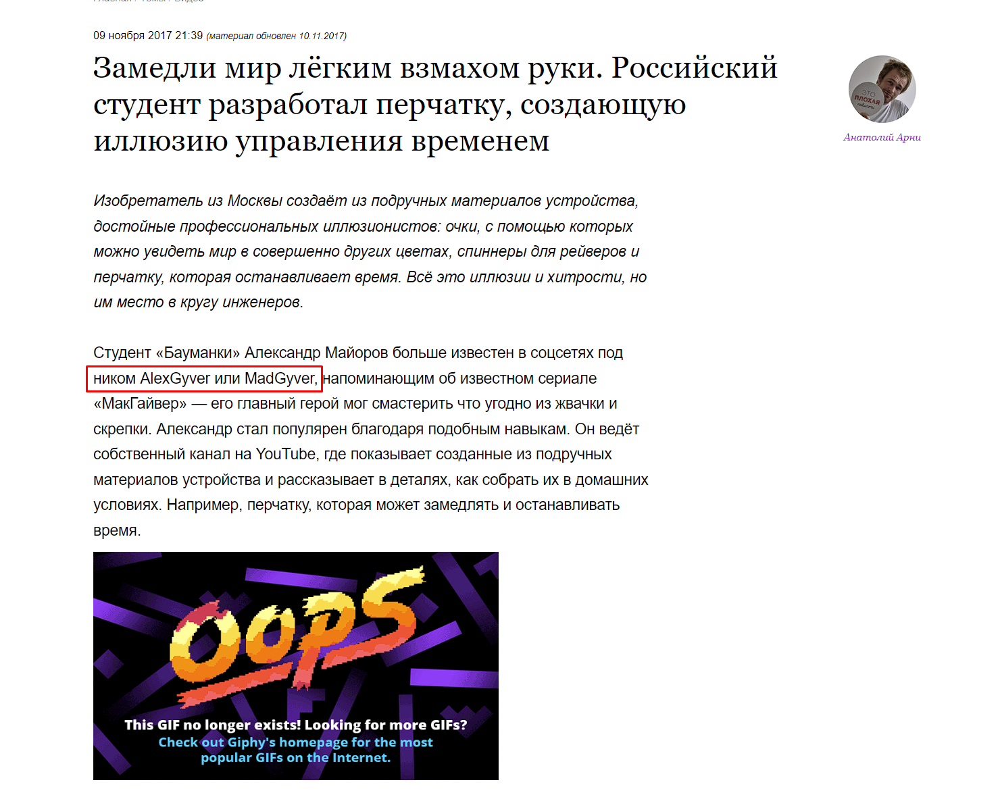
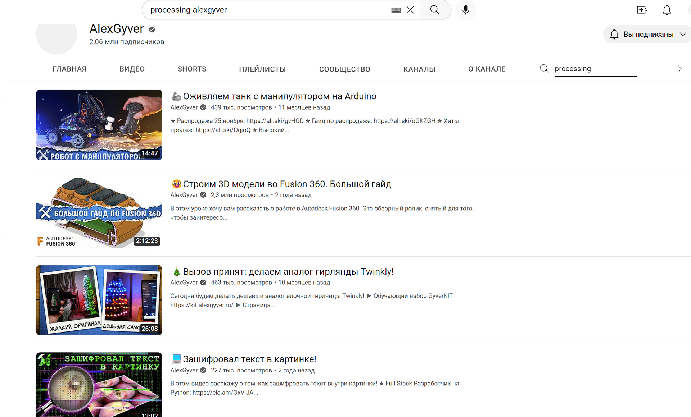

# Processing

## Описание
Решил я значит скачать картинку смешную, но не могу понять почему расширение такое странное? И название key!! В общем думаю ты сможешь понять что тут такое.

Кстати, чуть не забыл, когда я ее скачивал, мне на глаза попалось упоминание какого-то alexunder03. Думаю это может быть полезно.

Пример ответа `NARFUCTF{zdes_bydyt_slova}`

## Решение

Для начала гуглим, что такое alexunder03 и находим страницу в ВК.

Далее можно сделать поиск по фотографии. 

Здесь мы видим название статьи, в которой упоминается данный человек

Смотрим статью и видим полезную информацию.

Дальше можно поискать по каналу. Тут то мы и находим ссылку на то, что скорее всего нас интересует. 

Тут же можно найти ссылку на исходники программы.

Сначала нужно скачать Processing и исходники для работы с [GitHub](https://github.com/AlexGyver/crypto). Запускаем Processing. Открываем скачаную папку с GitHub и заходим в папку image-sound. Дальше в cryptoProSound и запускаем файл с расширением pde. Запускаем программу и загружаем нашу фотографию в Load crypt image. Декриптим с кодом key и получаем аудиозапись. Прослушав которую мы и получаем ответ.

## Ответ
`NARFUCTF{this_is_cat_beast}`