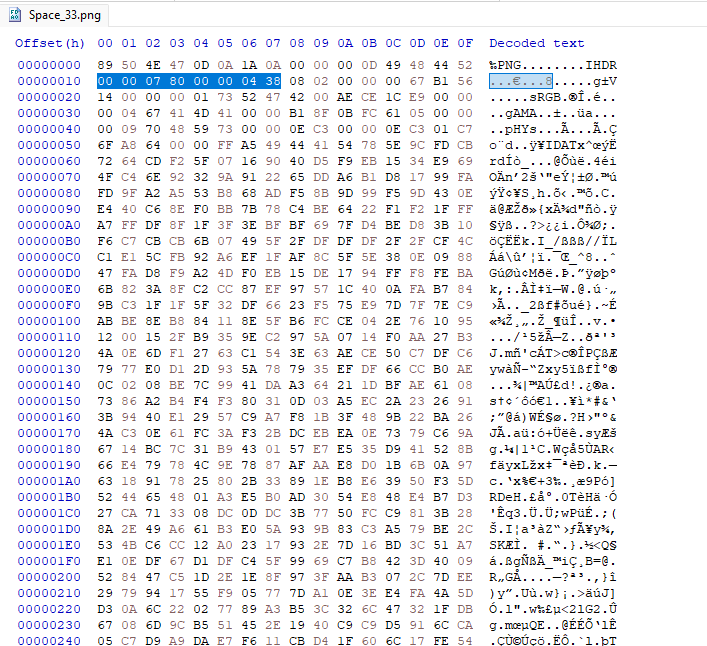
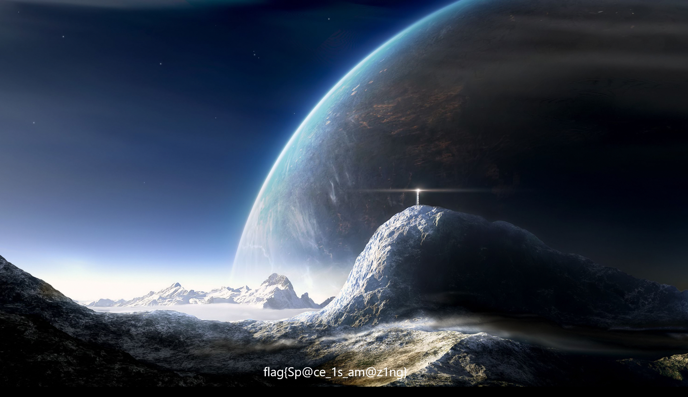

# Space 

## Описание
Сможешь ли ты найти на картинке флаг? Нет? А он здесь точно есть)


## Решение

Если загнать файл в PngCheck. То увидим, что CRC файла не сходится с тем, что должно быть. 
Значит он был модифицирован. 

```
File: /app/uploads/5e8cf653cdf2b5ee41c2131c8b059730/image.png (2566792 bytes)
chunk IHDR at offset 0x0000c, length 13
1920 x 1025 image, 24-bit RGB, non-interlaced
CRC error in chunk IHDR (computed 44c40071, expected 67b15614)
ERRORS DETECTED in /app/uploads/5e8cf653cdf2b5ee41c2131c8b059730/image.png
```

Также в глаза бросается то, что высота изображения 1025,  а не 1080, как полагается. 

Тогда отредактируем байты, которые отвечают за размеры изображения.





## Ответ
`flag{Sp@ce_1s_am@z1ng}`