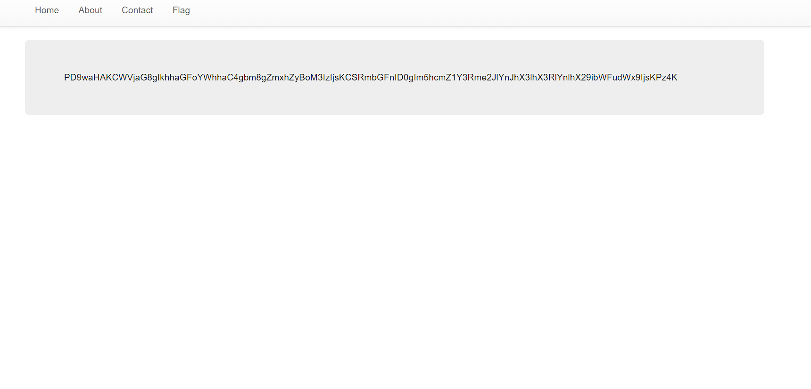
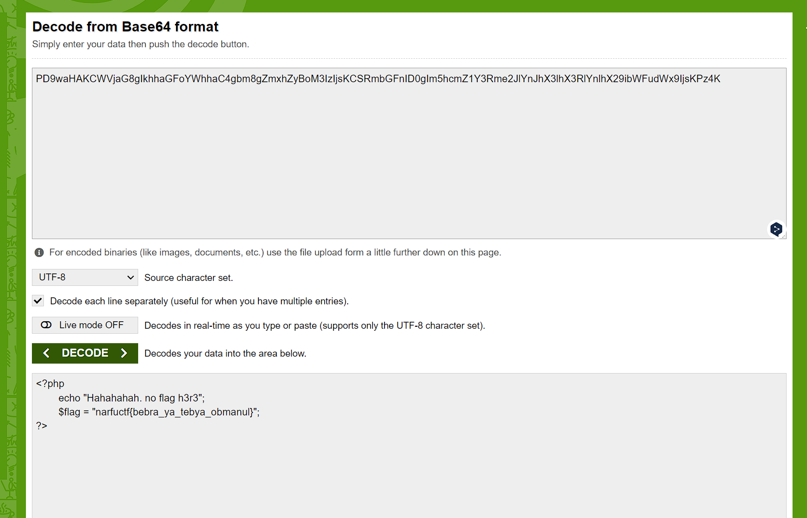

# ArTiclez

## Описание

Ты должно быть справился с первым заданием. Кстати, видел, что флаг прямо на главной странице есть? Ну то есть...Ну ты понял. А его получить сможешь?

## Решение

Второй флаг в этом задании завязан на том, чтобы прочитать получить файл из PHP скрипта. Однако сделать это не так просто, потому что флаг скрыт в самом скрипте. 

Сервер интерпретирует скрипты, так что флаг не выводится.

Чтобы получить флаг, требуется воспользоваться оберткой PHP 

`http://example.com/index.php?page=php://filter/convert.base64-encode/resource=index.php`

Далее декодируем:

## Ответ

`narfuctf{bebra_ya_tebya_obmanul}`