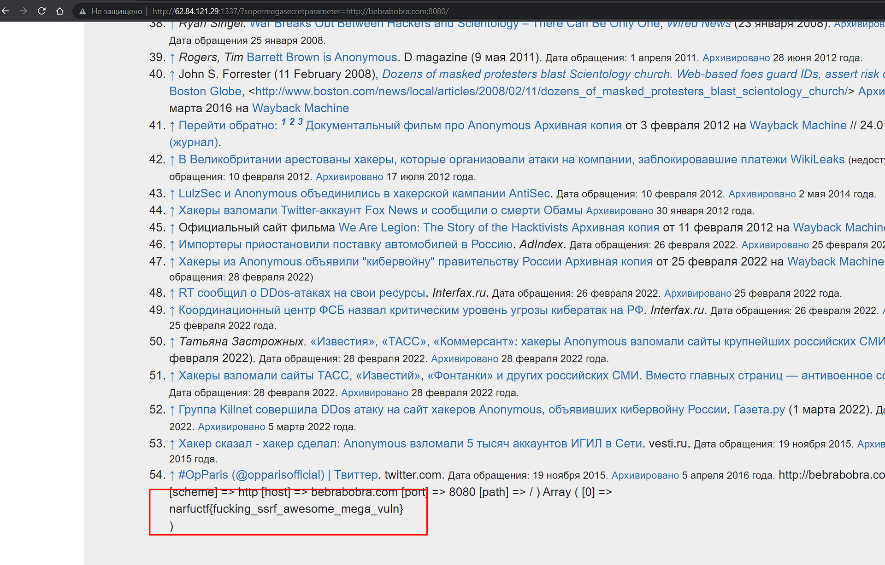

# Articlez, anonymous and etc

## Описание

Чел, ты вроде уже шаришь че каво, так что тебе не нужны мои подсказки. 

## Решение

Если решить предыдущие два задания, то на этот момент нам уже будет известно то, что мы можем читать любые файлы на сервере. Пользуясь этим, прочтем `index.php`  и увидим там следующий код.
 ```php
if (isset($_GET['sopermegasecretparameter'])) {
        $kek = $_GET['sopermegasecretparameter'];
        echo $kek;
        if(filter_var($kek, FILTER_VALIDATE_URL)) {
                // разобрать URL
                echo "Hello";
                $r = parse_url($kek);
                $a = 0;
                print_r($r);
                // проверить, заканчивается ли хост на google.com
                if(preg_match('/bebrabobra\.com$/', $r['host'])) {
                         // получить страницу по URL-адресу
                        exec('curl -v -s "'.$kek.'"', $a);
                        print_r($a);
                        //echo $a;
                } else {
                        echo "Ошибка: хост не разрешен";
                }
        } else {
                echo "Ошибка: неверный URL";
        }

}
```

Здесь нет ничего сложного. Видно, что у нас есть SSRF, которая позволяет обращаться толко к домену `bebrabobra.com`. Далее можно просканить этот домен, и на 8080 порту мы увидим, флаг. 

Вторым вариантом является получение RCE, которая позволяет посмотреть содержимое директорий и найти секретный каталог. 



## Ответ

`narfuctf{fucking_ssrf_awesome_mega_vuln}`
