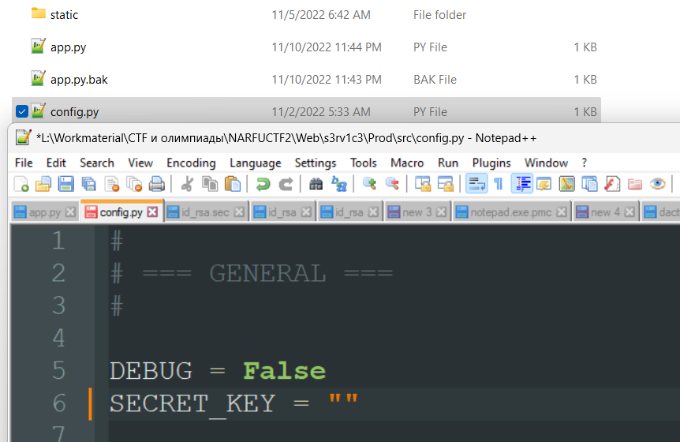
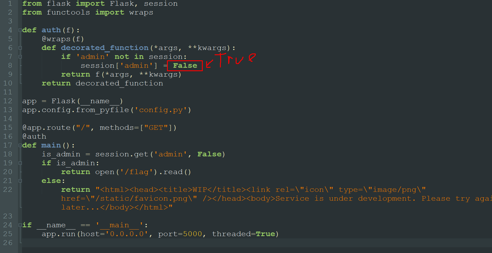

# s3rv1c3

## Описание

Слыхал про пентест? Так вот, у нас есть заказ, можешь позаниматься? Сервис находится на 7778 порту.

## Решение

Первым делом лезем в куки и смотрим, что там есть. Декодировав ее, увидим, что значение Admin установлено на False. Есть над чем думать, работаем дальше.

После можно пофаззить на наличие LFI каким нибудь сканером. То есть составленный запрос `dactf.com/static../app.py` позволит нам скачать исходный код приложения. 

Учитывая то, что у нас есть доступ к просмотру локальных файлов в корневой папке, то можно попробовать побрутить директории и файлы. 

После удастся найти гит репозиторий из которого можно будет выгрзить исходники кода (https://github.com/arthaud/git-dumper). 

Когда выгружаются исходники, то там видно наличие токена в файле конфигурации. Вернее, то, что он там должен быть. 

Так как мы имеем LFI, то мы можем скачать конфиг с развернутого сервера и упереть оттуда токен. Далее локально поднимаем приложение, предварительно поменяв значение выдачи куки, чтобы сгенерировать себе локально админскую куку. 

Дальше эту куку нужно просто поставить в развернутый сервер. 

## Ответ

`narfuctf{when_you_sl33p_last_time_arhgh?}`